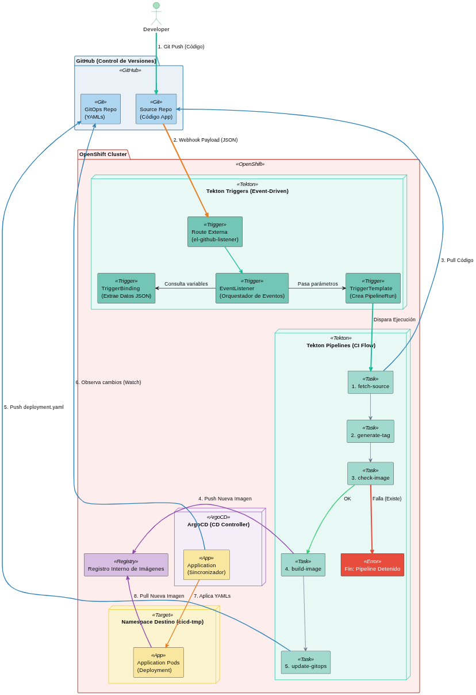

# CI/CD Workshop: Tekton & OpenShift GitOps

This repository contains automated setup scripts to deploy a complete CI/CD pipeline using **Red Hat OpenShift Pipelines (Tekton)** and **OpenShift GitOps (ArgoCD)**.

## Architecture Overview
The following diagram illustrates the complete CI/CD flow automated by these scripts.



* **CI (Continuous Integration):** Triggered by `setup-ci.sh`. Clones the source code, generates a dynamic image tag based on the commit SHA, validates image immutability, builds the container using Buildah, and updates the GitOps repository.
* **CD (Continuous Deployment):** Managed by ArgoCD (`install-cd.sh` and `setup-cd.sh`). Automatically synchronizes the Kubernetes manifests from the GitOps repository to the target namespace.

## Prerequisites
* An active OpenShift Cluster (v4.x).
* OpenShift Pipelines Operator installed.
* OpenShift GitOps Operator installed.
* `oc` CLI configured and logged in with `cluster-admin` privileges.

## Execution Order

> Variables archivo .env
```bash
# CI
APP_IMAGE_NAME='httpd-demo'
APP_NEW_IMAGE_TAG='1.0.0'
GITHUB_CONFIG_REPO=https://github.com/tu-nombre/taller-httpd-release-engineering.git
GITHUB_SOURCE_REPO=https://github.com/tu-nombre/taller-httpd-application-engineering.git
GITHUB_TOKEN=ghp_XXXXX
GITHUB_USER=tu-nombre
NAMESPACE=cicd-tu-nombre

# CD/ARGO
ARGO_AUTHOR=tu-nombre
ARGO_ENV=dev
ARGO_NAMESPACE=argocd-taller
ARGO_TEAM=application

```
1. Log in to OpenShift as an administrator.
```bash
oc login -u admin  https://api.cluster.apps.com:6443
```

2. Clone this repo

3. Review default variables and provide credentials!!

4. Install ArgoCD Instance
Creates the namespace and provisions the ArgoCD instance via the Operator.
```bash
sh install-cd.sh
```

5. Configure simple CI
```bash
sh setup-ci.sh
```

6. Configure simple CD
```bash
sh setup-cd.sh
```